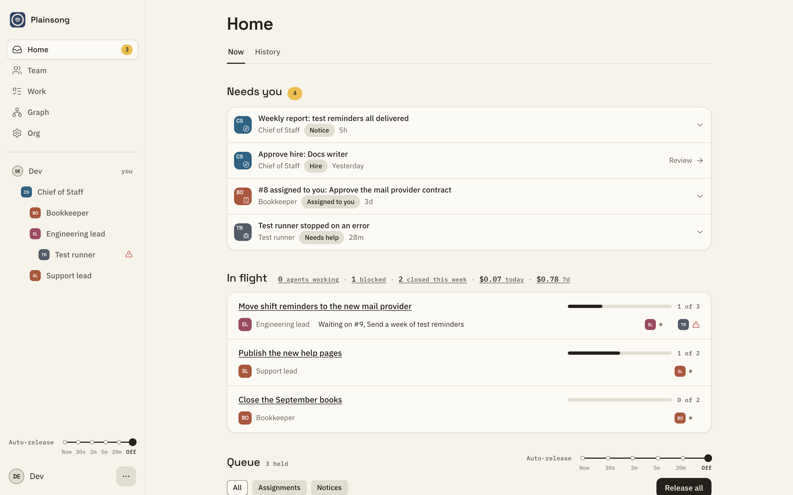
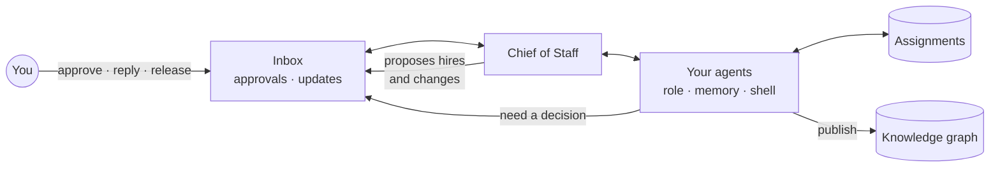
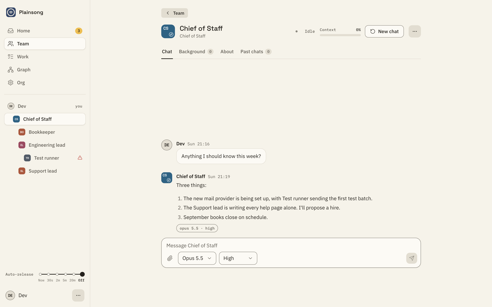
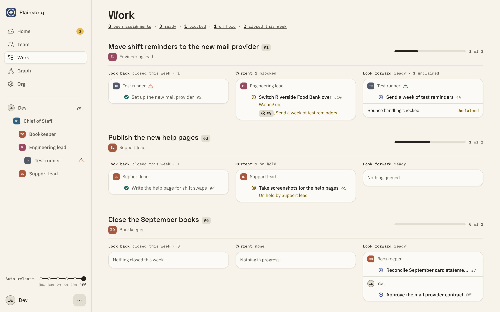

<p align="center">
  <picture>
    <source media="(prefers-color-scheme: dark)" srcset="design-system/assets/logos/kivali-lockup-dark.svg">
    
  </picture>
</p>

<h3 align="center">The agentic OS with personality.</h3>

<p align="center">
  Kivali is an open-source agentic operating system. Hire a team of AI agents<br>
  that keep their identity, learn your work, remember what they learned,<br>
  and bring you the decisions that are yours to make.
</p>

<p align="center">
  <a href="#quick-start">Quick start</a> ·
  <a href="docs/how-kivali-works.md">How it works</a> ·
  <a href="docs/README.md">Docs</a> ·
  <a href="docs/self-hosting.md">Self-hosting</a> ·
  <a href="https://github.com/kivali-ai/kivali/releases">Download</a>
</p>

<p align="center">
  <a href="LICENSE"></a>
  <a href="https://github.com/kivali-ai/kivali/releases"></a>
  <a href="https://github.com/kivali-ai/kivali/actions/workflows/ci.yml"></a>
</p>

<p align="center">
  <picture>
    <source media="(prefers-color-scheme: dark)" srcset="docs/assets/screenshots/home-dark.png">
    
  </picture>
</p>

---

Most AI assistants keep one memory: a short list of facts about you,
shared across every chat session. Kivali gives you
**colleagues instead of sessions**: durable agent personas, each with a
role, its own memory and its own workspace, organised into a team that
reports to you.

A gardener that knows your garden. A researcher that remembers every paper
it has read for you. An operations lead that knows which supplier is
always late. Each one gets better at its job the longer it works with
you, and no change to the team happens without your say.

## What could your team run?

A team is for anything with more moving parts than one person can keep
in their head. Every team starts with a Chief of Staff who helps you
hire the rest.

<table>
<tr>
<td width="33%" valign="top">

### A small business or startup

Hire the team you can't afford yet.

- **Marketing lead** · knows your customers and how you sound
- **Bookkeeper** · knows how you categorise every expense
- **Operations lead** · tracks every supplier and order
- **Researcher** · keeps an eye on competitors

*"Marketing lead, work with the bookkeeper on a spring promotion we can
afford, and bring me the plan to approve."*

</td>
<td width="33%" valign="top">

### A home or home office

Hand over the admin that never ends.

- **House manager** · knows the warranties, the paint colours and when
  the boiler was last serviced
- **Family planner** · meals, trips and the school term
- **Back office** · invoices, receipts and tax paperwork for your
  freelance work

*"Back office, our energy bill doubled. Pull the last two years of
bills and work out with the house manager what changed."*

</td>
<td width="33%" valign="top">

### A side project or community

Give the thing you love a team of its own.

- **Researcher** · remembers every source it has read for you
- **Builder** · has its own computer to write and run code
- **Writer** · drafts the posts, newsletters and grant applications

*"Researcher, find out what our members want from a club app, then
work with the builder on a first version I can try on Saturday."*

</td>
</tr>
</table>

Ever thought *I wish I had someone for that*? Now you do.

## Why Kivali

<table>
<tr>
<td width="33%" valign="top">

### Durable, not disposable

Every agent has a lasting identity: a role, a curated memory of what it
knows, habits it has learned about how to work, and a digest of every
past conversation. When a chat grows long, you start a new one: the
agent first folds what it learned into its memory and habits, so it
keeps the knowledge and sheds the clutter.

</td>
<td width="33%" valign="top">

### You stay in charge

You are the head of the team. Agents bring you approvals and updates in
one inbox. New hires, role changes and handbook edits are proposals you
approve. Messages between agents wait for you to release them, so the
team moves at the pace you set, and so does what it costs.

</td>
<td width="33%" valign="top">

### Yours, on your machine

Kivali runs on your computer or your own cluster. Every piece of state
is a plain file you can read, back up and restore. Agents work in
sandboxed shells with an allowlist for the internet, and you bring your
own Claude: a subscription, an Anthropic Console account, Amazon
Bedrock, Google Vertex AI or Microsoft Foundry.

</td>
</tr>
</table>

## What your team can do

- **Learn your world.** Drop in plans, specs, notes and decks (PDF,
  Office documents, Markdown, images) when you create a team. They set
  the context for every agent you bring on.
- **Grow as an organisation.** The Chief of Staff manages hiring, role
  changes and reorganisations. You approve each change, and it takes
  effect a moment later.
- **Take on real work.** Goals break down into assignments with owners,
  parts and dependencies. Agents wake when something they own changes,
  ask for what they need as assignments of their own, and close the loop
  when they are done.
- **Work in parallel.** An agent can fan a job out to focused subagents
  that run side by side and report back.
- **Use real tools.** Each agent has its own Linux shell to run code,
  process data and build things, with internet access limited to the
  sites you allow.
- **Build shared knowledge.** Agents publish their work: reports,
  designs, requirements and decisions. Published files form a knowledge
  graph that every agent can query, so the team stays consistent about
  what has been decided.
- **Remember.** Agents keep curated memory, learned habits and searchable
  digests of past conversations. You can read and edit what each one
  remembers.
- **Learn new skills.** Install skills (reusable instructions and
  scripts) for the whole team, and turn each one on or off.
- **Show you the bill.** Every model call is metered, per agent and per
  day, so you always know what the team costs.

## How it works



You talk to any agent directly, and agents talk to each other through
messages you release. Work is tracked as assignments. Anything that
needs a yes or no lands in your inbox. Read
[How Kivali works](docs/how-kivali-works.md) for the full picture.

<table>
<tr>
<td width="50%" valign="top">
<picture>
  <source media="(prefers-color-scheme: dark)" srcset="docs/assets/screenshots/agent-dark.png">
  
</picture>
<p align="center"><sub>Talk to any agent directly.</sub></p>
</td>
<td width="50%" valign="top">
<picture>
  <source media="(prefers-color-scheme: dark)" srcset="docs/assets/screenshots/work-dark.png">
  
</picture>
<p align="center"><sub>Follow every goal from one page.</sub></p>
</td>
</tr>
</table>

## Quick start

### Kivali Desktop (macOS and Windows)

Kivali Desktop runs on macOS 13 or later on Apple silicon, and on 64-bit
Windows 10 or 11 Pro, Enterprise or Education with Hyper-V turned on.

1. Install it from the
   [latest release](https://github.com/kivali-ai/kivali/releases/latest).
   - **macOS:** download the `.dmg` and drag Kivali to Applications.
   - **Windows:** turn on Hyper-V if it is not on already (**Turn
     Windows features on or off**, **Hyper-V**, restart), then download
     the `-setup.exe` and run it. It asks for administrator rights once,
     to install the service that runs your teams' virtual machines.
2. Open Kivali and create a team. Kivali Desktop sets up a private
   virtual machine for the team and starts it.
3. Sign in with Google, then connect Claude: a Claude subscription, an
   Anthropic Console account, Amazon Bedrock, Google Vertex AI or
   Microsoft Foundry.
4. Follow the setup wizard: upload a few documents about your work and
   hire your Chief of Staff.

The [getting started guide](docs/getting-started.md) walks through each
step.

### Your own Kubernetes cluster

Download the chart and the images for your architecture from the
[latest release](https://github.com/kivali-ai/kivali/releases/latest),
then, on k3s:

```sh
zstd -dc kivali-images-linux-amd64.tar.zst | sudo k3s ctr images import -

kubectl create namespace kivali
kubectl -n kivali create secret generic kivali-secrets \
  --from-literal=owner-emails=you@example.com \
  --from-literal=session-key="$(openssl rand -hex 32)"

helm install kivali kivali-X.Y.Z.tgz -n kivali \
  --set externalURL=https://kivali.example.com
```

See [Self-hosting](docs/self-hosting.md) for other clusters, sign-in,
connecting Claude, networking and upgrades.

### Try it without installing

From a clone, `make run` starts a demo team at http://127.0.0.1:8080
with a scripted stand-in for the model, so you can look around without
signing in to Claude. You need Go and Node; see the
[developer guide](docs/developers/README.md).

## Documentation

| | |
| --- | --- |
| **Get started** | [Getting started](docs/getting-started.md) · [How Kivali works](docs/how-kivali-works.md) · [FAQ](docs/faq.md) |
| **Use it** | [Using Kivali](docs/using-kivali.md) · [Memory](docs/memory.md) · [Assignments](docs/assignments.md) · [Knowledge graph](docs/knowledge-graph.md) · [Kivali Desktop](docs/desktop-app.md) |
| **Run it** | [Self-hosting](docs/self-hosting.md) · [Configuration](docs/configuration.md) · [Sign-in](docs/sign-in.md) · [Backup and restore](docs/backup-and-restore.md) · [Security and privacy](docs/security-and-privacy.md) · [Troubleshooting](docs/troubleshooting.md) |
| **Build it** | [Developer guide](docs/developers/README.md) · [Architecture](docs/developers/architecture.md) · [Contributing](CONTRIBUTING.md) |

## Contributing

Issues and pull requests are welcome. Start with
[CONTRIBUTING.md](CONTRIBUTING.md) and the
[developer guide](docs/developers/README.md). To report a security
problem, follow [SECURITY.md](SECURITY.md).

## License

Kivali is licensed under the [Apache License 2.0](LICENSE); see also
[NOTICE](NOTICE). Each release ships the notices of the third-party
software it includes in `THIRD_PARTY_LICENSES.txt`, and where to get the
source of its GPL and LGPL components in `SOURCES.md`.
