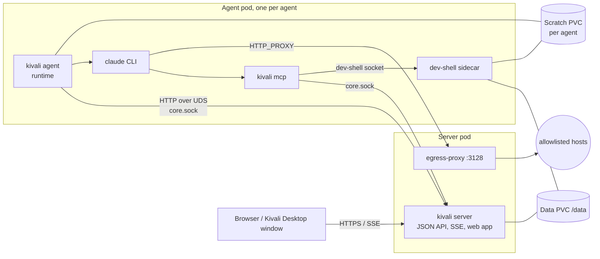
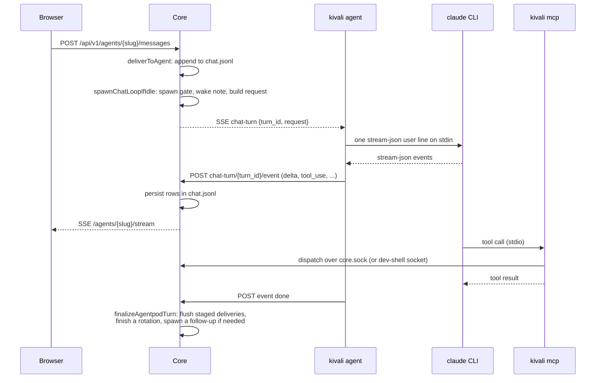

# Architecture

How the pieces of Kivali fit together: the server, the agent pods, the
model driver, storage, and how a message becomes a turn. The user-level
picture is [how-kivali-works.md](../how-kivali-works.md); this is the
developer's.

## The pieces



### The server (core)

One Go binary, `kivali` (`main.go`). With no subcommand it is the
server. It owns every durable byte and is the only writer to `/data`
(`internal/store`). It serves:

- **The web app**: the Vite build of `web/`, embedded from
  `internal/web/ui/dist` and served for every GET no other route
  claims (`internal/web/ui`).
- **The JSON API** under `/api/v1/` (`internal/web/api*.go`; wire
  types in `internal/web/apitypes`, mirrored to TypeScript by
  `make api-types`).
- **Server-Sent Events**: `/org/stream` (a snapshot-first feed of
  every agent's liveness, Home's counts and the queue;
  `internal/web/org_stream.go`), `/agents/{slug}/stream` (one agent's
  live chat events; `internal/web/chat_hub.go`) and
  `/agents/{slug}/subagents/{id}/stream` (one background task's
  transcript).
- **Auth**: Google sign-in, the allowlist and session cookies
  (`internal/auth`, [auth.md](auth.md)). `DEV_MODE` bypasses all of it
  and only binds loopback.
- **Two Unix sockets with one route table** (`internal/web/control_socket.go`,
  `registerUDSRoutes`): the control socket at
  `$DATA_DIR/.kivali-control.sock`, reachable only from inside the
  server container, and `core.sock` in `AGENTPOD_UDS_DIR`
  (`/var/run/kivali/uds` in the chart), a hostPath directory the agent
  pods on the same node mount. Both are mode 0600; file permissions
  and a matching UID are the authentication. Every agent-scoped route
  is `/v1/agent/{slug}/...` and must carry `X-Kivali-Agent: <slug>`;
  the server rejects a mismatch, and overrides any `from`/parent in a
  body with that slug.

Layering inside the server: `internal/store` (files, the only
writer) → `internal/agent` (per-agent runtime: context assembly, tool
dispatch, hire/offboard) and `internal/messaging` (routing, release,
bounce) → `internal/web` (HTTP, hubs, turn orchestration). The model is
reached through `internal/provider`, a provider-neutral seam, whose one
implementation is `internal/claudeagent`.

### Agent pods

Every agent except the CEO runs in its own pod, `agentpod-<slug>`,
which the server provisions on hire and deletes on offboard
(`internal/agentpod/provisioner.go`, `manifest.go`). The pod has no
Service and no ports, no service-account token, and a required
pod-affinity to the server's node, because the hostPath socket exists
only there. It owns no authoritative state: delete it and nothing is
lost.

| Container | Image | What it does |
| --- | --- | --- |
| `prepare-scratch` (init) | `kivali` | `kivali prepare-scratch`: mounts the whole per-agent scratch PVC and creates its two halves, owned by the pod's user |
| `agent` | `kivali` | `kivali agent --slug=<slug> --uds=<dir>/core.sock` (`agent_cmd.go`, `internal/agentpod/runtime.go`): holds the events stream to core, drives the warm `claude` CLI and its subagent CLIs. Mounts its half of scratch at `/scratch`, the UDS dir, the dev-shell socket dir, and from the data PVC only the provider home (`/data/claude-home`). The only container that sees the Claude sign-in. When the CLI's sign-in changes (what `claude auth status` reports, or `settings.json`; re-checked when `.credentials.json` or `settings.json` changes), the runner registry respawns the warm CLI with `--resume` at the agent's next turn (`internal/claudeagent/signin.go`) |
| `dev-shell` | `kivali-dev-shell` | `cmd/dev-shell`, `internal/devshell`: an HTTP-over-UDS daemon on `/run/kivali-dev-shell/sock` (an emptyDir shared with `agent`) that runs `run_shell` and every `file_*` tool. The only container that mounts the agent's `/files/`, with `HOME=/scratch/home` on its own half of scratch |

The dev-shell's `/files/` is the agent's tree on the data PVC
(`agents/<slug>/memory/`), with the core-managed subtrees
(`project/`, `skills/`, `attachments/`, `past-chats/`, `episodes/`,
`artifacts/public/`, `artifacts/shared/`) mounted read-only over it,
and the targets of its symlink farms (`/data/project_files`,
`/data/skills`, `/data/agents/<slug>/attachments`,
`/data/agents/<slug>/chats`) mounted read-only beside it. So `bash`
and `file_view` see the same bytes at the same paths, and nothing an
agent can write sits next to the Claude credentials.
[files-and-publishing.md](files-and-publishing.md) has the layout and
the publish path.

**Reconcile.** The pod manifest carries a `kivali-spec-hash` label, a
hash of the rendered spec. `Provision` leaves a pod whose label matches
and deletes and recreates one that differs, so a new server image or env change reaches every agent the next time
the server provisions. At boot the server syncs each agent's filesystem and provisions every active agent
(`BulkProvisionAgentPods`); hire does the same for one. The scratch
PVC is never diffed and survives offboarding.

**The agent pod's protocol** (`internal/agentpod/protocol.go`). Core
never dials an agent; every connection goes from the pod to
`core.sock`:

- `GET /v1/agent/{slug}/events`: a long-lived SSE stream from core.
  Events: `chat-turn` (drive a turn; carries the fully built model
  request), `fold-message` (splice a message into the running turn),
  `cancel-turn` (Stop), `session-reset` (a chat was archived: drop the
  warm CLI), `cache-invalidate`, `ping`. Comment heartbeats every 15 s.
- `POST /v1/agent/{slug}/chat-turn/{turn_id}/event`: every streamed
  event of a turn (deltas, thinking, tool use and results, folded,
  done, failed) goes back one POST at a time.
- Data and tool dispatch: chat history and append, role, memory,
  session id, past chats, attachments and project files (content
  addressed), skills, publish stage/commit, artifact, state and
  share-file dispatch, route-message, run-subagent and its
  status/cancel.

### The model driver

`internal/claudeagent` drives the Claude Code CLI
(`@anthropic-ai/claude-code`). Each agent has one warm runner: a
long-lived `claude -p --input-format stream-json` subprocess whose
stdin stays open across turns (`runner.go`). A turn writes one user
line; the stream-json output is translated into provider stream
events. The runner is spawned with `--resume <session-id>` when one is
stored, so a restarted pod continues the conversation. Model, effort
and system prompt are spawn-time flags: when any of them differs from
the next request the runner respawns with `--resume`, which is how an
edit to the handbook, role or memory lands on the next turn. A runner
that dies within seconds of a `--resume` spawn has its session id
cleared, so a corrupt session log cannot loop.

The CLI's tools come from `kivali mcp --agent <slug> --core-uds ...`
(`mcp_cmd.go`, `internal/mcp`), an MCP server over stdio that the CLI
starts. It dispatches `run_shell` and `file_*` to the dev-shell socket
and everything else to core over `core.sock`. The tool surface is
listed in [context-serialization.md](context-serialization.md) and the
model catalog lives in `internal/claudeagent/catalog.go`.

**Billing.** The CLI signs itself in, once, in the server container:
`kivali-supervisor terminal` runs `claude`, which shows its sign-in menu
when it is not signed in (`/login` switches): a Claude subscription, an
Anthropic Console account, Amazon Bedrock or Google Vertex AI. Microsoft
Foundry has no CLI sign-in; Kivali Desktop's form writes it through the
supervisor's `POST /v1/credential/setup` (`internal/claudeauth`,
`setups.go`), or a self-hoster writes the `env` block by hand. What the
sign-in stores lives on the data PVC in `/data/claude-home/` (the CLI's
HOME: `.claude/.credentials.json`, and `.claude/settings.json`'s `env`
block for a cloud provider), which every agent pod mounts as the CLI's
home, so the whole deployment bills one way. No credential variable reaches an agent pod, and the server
refuses to start with `ANTHROPIC_API_KEY`, `ANTHROPIC_AUTH_TOKEN` or
`CLAUDE_CODE_OAUTH_TOKEN` set. Whether it is signed in, and to what, is
the CLI's own answer: `claude auth status --json`, parsed by
`internal/claudeauth`, for the server's setup state
(`Credentials().Status`) and the supervisor's `GET /v1/credential`.
Agent pods reach Bedrock, Vertex AI and Foundry through the egress
proxy; the default allowlist carries their hosts.

The server also calls the model itself for short jobs that are not an
agent's turn: the setup briefing, inbox summaries and episode digests.
Every call appends a record to `/data/usage.jsonl`.

### The egress proxy and the fence

`cmd/egress-proxy` runs as a sidecar in the server pod on port 3128,
behind the `kivali-egress` Service. It forwards HTTP and HTTPS
(CONNECT) only to hosts on the allowlist, a file the server writes from
`/data/allowed_egress.yaml` (Org → Network) into a shared emptyDir; the
proxy hot-reloads it. Agent containers get `HTTP_PROXY`/`HTTPS_PROXY`
pointing at it. A pattern covers its name and every subdomain; one with
`*` or `[...]` after an optional leading `*.` is a per-label glob
(`path.Match` on each label, so a wildcard never crosses a dot), which
is how the defaults reach every region's Bedrock and Vertex AI endpoint
without allowing all of `amazonaws.com` or `googleapis.com`. The
defaults are written once, when a team's list does not exist yet.

The proxy alone would be advisory. The chart's NetworkPolicy
(`charts/kivali/templates/networkpolicy.yaml`) makes it binding: agent
pods may reach only port 3128 on the server pod and DNS, so a raw
socket goes nowhere, and the server's HTTP port refuses pod addresses,
because the API trusts whoever reaches it as the owner. Details in
[../../charts/kivali/README.md](../../charts/kivali/README.md).

### Around the server

In every real deployment the server runs in k3s inside a VM that
`kivali-supervisor` boots and installs the chart into; Kivali Desktop
is the app that drives the supervisor. See
[supervisor.md](supervisor.md), [../../vm/README.md](../../vm/README.md),
[desktop-app.md](desktop-app.md) and [deployment.md](deployment.md).

## Storage

There is no database. Everything durable is a plain file under
`/data`, written by `internal/store` with atomic renames:

```
/data/
  handbook.md                 the rules every agent works under, inlined into every call
  message_queue.json          each agent's queue of unreleased messages
  messages/<YYYY-MM-DD>/      the message ledger, one Markdown file per message, UTC days
  messages/.redacted/         bounced messages, kept out of the live ledger
  assignments/                the assignment tracker (assignments.md)
  graph/                      the knowledge-graph index (knowledge-graph.md)
  public/<slug>/              each agent's published files
  project_files/<sha>/        uploaded project files, content-addressed
  attachments/<sha>/          message and chat attachments, content-addressed
  skills/                     uploaded and built-in skills
  skill_settings.json         which skills are enabled
  usage.jsonl                 one record per model call: tokens and cost
  allowed_egress.yaml         the egress allowlist
  branding/                   org name, logo and derived favicons
  claude-home/                the CLI's HOME: its sign-in and settings
  agents/<slug>/              one directory per agent (below)
  agents/_archived/<slug>/    offboarded agents; nothing is deleted
```

```
/data/agents/<slug>/
  agent.yaml                  identity and settings
  role.md                     the role, written at hire
  agent_memory.md             what the agent knows; it edits this itself
  agent_memory_habits.md      learned rules of behaviour
  chat.jsonl                  the current conversation, append-only
  chats/<ts>/                 archived generations: chat.jsonl, the memory
                              snapshots, episode.md
  attachments/                hardlinks to the attachments this agent has seen
  memory/                     the agent's /files/ tree (files.StorageDirName)
    artifacts/private/        its workspace
    background/               shared with its subagents (plan.md)
    subagents/<id>/           each subagent's view
    project/ skills/ attachments/ past-chats/ episodes/   symlink farms, read-only
```

## A turn



1. Something external lands in the agent's `chat.jsonl` as a
   `received` row through `deliverToAgent` (`internal/web/chat.go`):
   the CEO typing, a released message, a subagent's result, a rotation
   prompt.
2. `spawnChatLoopIfIdle` decides whether to start a turn
   (`store.SpawnDecision`: an unanswered received row, or a disruption
   to resume from; never after a Stop until the CEO writes again;
   never for a quarantined agent with three runtime disruptions in a
   row). It appends the wake note (what changed and what the agent
   holds; [knowledge-graph.md](knowledge-graph.md)), builds the
   request with `agent.Runtime` (the layering is in
   [context-serialization.md](context-serialization.md)) and publishes
   a `chat-turn` event to the agent's pod.
3. The runtime runs it on the warm CLI and posts every event back.
   Core persists the rows and broadcasts them to the page; tool calls
   go from the CLI to `kivali mcp` and on to core or the dev-shell.
4. On `done`, `finalizeAgentpodTurn` (`internal/web/agentpod_turn.go`)
   flushes deliveries staged during the turn and, if any arrived,
   spawns the follow-up turn that reads them. On `failed`, core writes
   a `turn-error` or `runtime-disruption` marker row; an errored agent
   holds until a new message arrives.

## Message delivery

Agents publish with `publish_notice`, `publish_ceo_approval_request`
and `publish_ceo_notification`; assignments produce `assignment_event`
messages ([assignments.md](assignments.md)). A publish is routed inside
the tool call (`internal/messaging`): the message file is written to
the ledger and routed under the queue lock, so it exists the moment it
is sent.

- **Agent to agent**: queued in the recipient's entry in
  `message_queue.json`. Nothing is delivered until the CEO **releases**
  it from the Queue on Home: one at a time (with an optional inline
  comment), all at once (*Release all*, which also wakes every active
  agent), or automatically after a delay set on the Queue's slider
  (`internal/web/auto_release.go`). A **bounce** drops every pointer,
  moves the file to `messages/.redacted/` and sends the sender a
  notice with the CEO's required comment.
- **To the CEO**: never queued. It is appended to the CEO's inbox at
  once, and the CEO's answer (approve, deny, ack, reply) is delivered
  to the sender at once. An approved proposal is applied before the
  answer is delivered.
- **Delivery** is `Messenger.DeliverToAgent`, which renders the inbox
  body and hands it to the server's `deliverToAgent`, then wakes the
  recipient. A message marked **quiet** (and a pure receipt) is
  delivered without a wake: it folds into a running turn or is read at
  the next one.

### Arriving during a turn: folds and pending messages

`deliverToAgent` has three cases:

- **Idle agent**: append to `chat.jsonl`.
- **A turn is running**: stage the message in a per-agent buffer and
  offer it to the turn as a **fold** (`fold-message`). The CLI splices
  a uuid-stamped user line into the running turn at its next tool
  round; the runtime reports whether it was taken. A message the CLI
  takes after the turn's last step is answered in a continuation the
  runtime keeps as part of the same turn. A fold the pod refuses asks
  the turn to wind up (a `cancel-turn` for the parent turn only).
  Whatever is still staged is flushed when the turn ends.
- **A rotation is running**: stage only. The message opens the new
  chat after the archive.

Staging exists because the turn is writing its own rows to
`chat.jsonl`; a received row spliced into the middle would break
append order and the tool-use/tool-result pairing. `chat.jsonl` only
ever holds what the model has.

A staged **CEO direct message** is shown on the agent page as a
**pending** message (`internal/web/chat_pending.go`): the stream sends
`pending_message`, `pending_offered`, `pending_delivered` and
`pending_deleted`, and a page that connects mid-turn seeds from the
chat endpoint. Until it has been offered as a fold, the CEO can delete
it (with a short undo window); **Send now** ends the turn early,
keeps the partial reply, writes a `paused-to-deliver` marker and
delivers every pending message under it. Pending messages live only in
memory, never in `chat.jsonl`. Other staged deliveries (releases,
subagent results) are not shown until they land.

## Subagents

An agent delegates with the `subagent` tool, up to five tasks per call
(`internal/mcp/subagent_tool.go`). Dispatch returns a receipt at once;
each task is a background job (`internal/web/subagent_service.go`,
`subagent_jobs.go`) and its result reaches the parent later as a
`subagent_result` message that wakes it. `subagent_status` and
`subagent_cancel` list and stop the parent's jobs.

Every subagent runs inside the **parent's agent pod**: core publishes a
`chat-turn` event of kind `subagent`, and the runtime starts a separate
`claude` process with its own `kivali mcp --toolkit subagent`. Its
files are a view core builds at `/files/subagents/<id>/`
(`internal/files/subagent.go`): its own `artifacts/private/`,
read-only links to the parent's project, skills, attachments and
published trees, and a writable `background/` shared with the parent
and every sibling, where `plan.md` describes the fan-out. Its tools are
the `file_*` set, `run_shell`, publishing, `list_skills` and the graph
reads.

Depth is capped at two tiers (`agentpod.MaxSubagentDepth`): a
first-tier subagent may act as a sub-lead and dispatch up to three
workers, which blocks it until they finish; workers cannot delegate.
Admission bounds cost (`internal/web/subagent_admission.go`): at most
six subagent CLIs per pod, of which at most four are first-tier, so a
worker can always be admitted and blocked sub-leads cannot deadlock the
pod. The pod's 4 GiB memory limit is sized for that ceiling. Stop on
the parent cancels its subagents.

## Chat rotation

**New chat** (`internal/web/handoff.go`) is how an agent's context is
reset without losing what it learned:

1. Core snapshots `agent_memory.md` and the habits file, mints the
   archive timestamp, delivers a rotation prompt asking the agent to
   reconcile its memory, writes a `pending_rotation` marker to disk and
   starts the turn.
2. The agent edits its memory with the `agent_memory_*` tools.
3. When that turn ends, `finalizeRotation` archives `chat.jsonl` and
   the snapshots to `chats/<ts>/`, clears the CLI session id, sends
   `session-reset` so the pod drops its warm CLI, removes the marker,
   and only then flushes the deliveries staged during the turn, so
   they open the fresh chat.

The marker survives a restart: a recovered turn finishes the rotation.
Off the critical path, the episode writer
(`internal/web/episode_writer.go`) digests the archived chat into
`chats/<ts>/episode.md`, which the agent reads at
`/files/episodes/<ts>.md`. The memory contract is in
[context-serialization.md](context-serialization.md).

## Running without pods

Outside Kubernetes the provisioner finds no service account and is a
no-op (`agentpod: disabled (not running in-cluster)` at boot). Chat,
messaging and release still work as long as something dials
`core.sock`. `make run` does exactly that: it seeds a data directory
with `cmd/devseed`, starts the server with `DEV_MODE=true` and
`AGENTPOD_UDS_DIR` set, and starts one `kivali-e2e agent --slug <slug>
--uds <dir>/core.sock --scratch <dir>` per agent on the host. With
`CLAUDE=fake` (the default) `cmd/fake-claude` stands in for the CLI.
There is no dev-shell; with `KIVALI_MCP_LOCAL_FILES=1` and
`KIVALI_MCP_LOCAL_FILES_ROOT` set (`make run` and the e2e suite set
both), `kivali mcp` runs `run_shell` and the `file_*` tools in-process
against that local tree ([../../web/e2e/README.md](../../web/e2e/README.md)).
