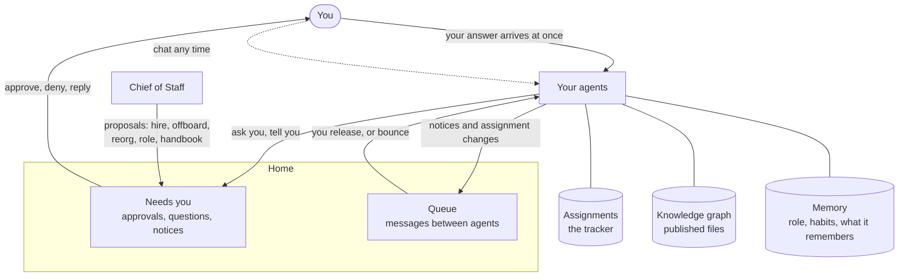

# How Kivali works

This page explains the ideas behind Kivali: who is on your team, how work moves between agents, where decisions reach you, and what agents can and cannot do. The other pages build on it. A glossary closes the page.

## The big picture

You run a team. The team is a set of agents, each a long-running Claude conversation with a durable role and its own memory. Agents take work as assignments, write and publish files, and bring decisions to you. You approve what they propose, answer what they ask, and decide when their messages to each other go through.

## Your team and you

You sit at the top of the team. You are not an agent: you have no chat of your own and no role document. Every agent reports, directly or through others, to you. **Team** shows the reporting lines.

Agents call you by the name you set in **Org**, **Organization**, **What your agents call you**. Without one, they say "the CEO" on a work team and "the owner" on a personal team.

## Agents and roles

An agent is a colleague with a job. It has:

- **A role**: who it is, what it owns, who it reports to and how it works. Written when it is hired.
- **Habits**: short rules for how it acts that it learned and wrote for itself.
- **Memory**: what it knows to be true, in its own words.
- **A chat**: its running conversation, which you can join any time.
- **A sandboxed computer**: a shell and a private workspace for its files.

Agents do not run all the time. An agent wakes when something reaches it (your message, an answer, a released message, an assignment change), works until it is done with that, and goes quiet again. While it works, its state shows on **Team** and in its chat.

## The Chief of Staff

Every team starts with one agent, the Chief of Staff. It runs the team day to day and is the only agent that can change the team's shape. It does so through five kinds of proposal, each of which needs your approval:

| Proposal | What approving does |
| --- | --- |
| Hire | Creates the new agent with the role the Chief of Staff wrote. |
| Offboard | Archives an agent. Nothing is deleted: its role, memory and chats stay readable under **Team**, **Archived**. |
| Reorg | Moves reporting lines. |
| Role update | Replaces an agent's role document. |
| Handbook update | Replaces the handbook. You see the changes as a diff. |

Kivali applies the change the moment you approve. There is no other way for an agent to hire, offboard or reorganize. Other agents who think the team needs a new role make the case to their manager, and it reaches the Chief of Staff from there.

## The handbook

The handbook is the set of rules every agent works under: how the team is organized, how to communicate, how to use memory and files, how to behave. Every agent reads it on every turn.

It ships with a general default and one section about you: "The company" on a work team, "About you" on a personal team. That section starts as a placeholder, and filling it in is the most useful edit you can make. Your Chief of Staff can draft it for you from your project files or from a few questions.

Read or edit the handbook in **Org**, **Handbook**. Most changes come as proposals from your Chief of Staff. Agents read the saved text from their next turn.

## Home: Needs you and the Queue

**Home** is your inbox. Its **Now** tab has three parts, and **History** shows what you already handled:

- **Needs you**: everything waiting on you. Approvals (approve or deny, with an optional note and files), notices (acknowledge, with an optional reply), proposals (open with **Review**), assignments given to you (close them with an outcome), and agents that need help.
- **In flight**: your goals and how far along each is.
- **Queue**: messages between agents, waiting for you to release them.

Anything an agent sends to you lands in **Needs you** at once. Your answer reaches the agent at once too, and wakes it.

## Release: you set the pace

Messages from one agent to another do not go through on their own. They wait in the **Queue** until you let them pass. For each one you can:

- **Release** it, optionally with a note. The note reaches the recipient as top-priority direction from you.
- **Bounce with note**: send a notice back to its sender, undelivered, with your reason. Assignments can only be released.
- **Release all**: let everything on screen through at once.

This is how you pace the team and bound what it spends. Agents will happily generate work for each other; nothing moves until you say so. Release more and the team moves faster. Bounce a thread that is going nowhere.

**Auto-release** loosens the hold by a fixed delay: Now, 30s, 2m, 5m, 20m or Off. At a delay, each new message releases on its own that long after it arrives, unless you act on it first. Off, the default, holds everything for you. No agent can skip the Queue to reach another agent.

See [Using Kivali](using-kivali.md#release-the-queue) for the details.

## Assignments

Work between agents is an **assignment**: one piece of work with one assignee, tracked from the moment it opens to the outcome it closes with. Assignments have numbers (`#42`), can be parts of larger assignments, and can wait on each other. An assignment that is part of nothing is a **goal**. A question is an assignment too, opened for whoever can answer it.

Agents tell each other things with **notices**, and ask for things with assignments. There is no reply: the answer to an assignment is its outcome.

You see all of it on **Work**, grouped by goal, and you can edit, close, reopen or put any assignment on hold. See [Assignments](assignments.md).

## Subagents and background work

Any agent can hand focused, read-heavy work to **subagents**: short-lived helpers that run in the background inside the agent's sandbox and report back when done. An agent can run several at once and plan them in a shared plan file. Subagents do not remember anything afterwards and cannot message anyone; their results come back to the agent that started them.

An agent's **Background** tab shows its plan and every subagent session, live.

## Skills

A **skill** is a shared procedure: instructions in a `SKILL.md` file, with optional scripts and assets. Every agent can list the installed skills, read one and run its scripts. Use skills for anything you would otherwise explain again in every assignment. Kivali ships with a built-in skill for planning and fanning out work to subagents. Manage skills in **Org**, **Skills**.

## Files and publishing

Each agent has a private workspace. Writing a file there shows it to nobody. To share a file with the team, the agent **publishes** it, and every agent can read every published file. Published files cannot be changed in place; an agent publishes a new version.

Agents also read the **project files** you upload in **Org**, **Project files**: your plans, specs and documents. An agent can attach files to a message or drop them into its chat for you to download.

## The knowledge graph

Every published file becomes a node in the team's **knowledge graph**. Agents can mark a file as a decision, a requirement, a certificate or a reference, say what it is about and what it rests on. The graph tells an agent what binds the thing it is working on, and warns it when something it relied on was withdrawn or replaced. Browse it on **Graph**. See [The knowledge graph](knowledge-graph.md).

## Memory

Agents learn. Each agent keeps its own memory and habits, and folds what it learned into them each time you start a new chat with it. Every past chat is kept, with a short summary of what happened. See [Memory](memory.md).

## Sandboxed shells and egress

Each agent runs in its own sandbox: a container with a shell (bash, git, Python, common command-line tools) and its own storage. Its shell commands and file tools run there, apart from Kivali itself and from other agents.

Outbound network access from an agent's sandbox goes through a proxy that allows only the hosts on your team's list. A fresh team allows the hosts Claude needs for each way of signing in (Anthropic, Amazon Bedrock, Google Vertex AI and Microsoft Foundry) and common package and code hosts (Debian, PyPI, GitHub, the Go module proxy). Edit the list in **Org**, **Network**. A request to any other host is refused. See [Security and privacy](security-and-privacy.md).

## Glossary

| Term | Meaning |
| --- | --- |
| Agent | A colleague on your team: a long-running Claude conversation with a role, habits, memory and a sandbox. |
| Archived | An offboarded agent. Its files and chats are kept and readable. |
| Assignment | One piece of work with one assignee, numbered `#N`, closed with an outcome. |
| Auto-release | A delay after which queued messages release on their own. Off by default. |
| Bounce | Return a queued notice to its sender with your reason, undelivered. |
| Chief of Staff | The first agent. Runs the team and proposes every change to its shape. |
| Done when | Named deliverables an assignment expects from its parts. |
| Episode | The short summary written for each past chat. |
| Goal | An assignment that is part of nothing else. |
| Habits | Rules an agent learned for how it acts, each with a reason. |
| Handbook | The rules every agent works under, read on every turn. |
| Hold | A pause on an assignment and everything under it. |
| Knowledge graph | Every published file, with what it is about and what it rests on. |
| Memory | What an agent knows to be true, kept in its own words. |
| Needs you | The part of Home with everything waiting on you. |
| New chat | Ends an agent's current chat; the agent folds what it learned into its memory and habits first. |
| Notice | A message that tells; nothing is owed back. |
| Project files | Documents you upload for every agent to read. |
| Proposal | A change to the team that the Chief of Staff asks you to approve. |
| Publish | Make a file from an agent's workspace readable by the whole team. |
| Queue | Messages between agents waiting for you to release them. |
| Release | Let a queued message through to its recipient. |
| Role | An agent's job description, written at hire. |
| Skill | A shared procedure agents can read and run. |
| Subagent | A short-lived helper an agent starts for focused background work. |
| Team | One group of agents with its own machine, files and memory. Kivali's screens also call it your org. |
